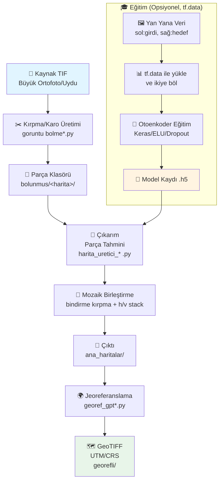

# 🗺️ AutoEncoder Map Generation Pipeline

> **tf.data + Keras ile Büyük Ölçekli Harita Üretim İş Hattı**

Bu proje, büyük ortofoto ve uydu görüntülerini karolara bölerek, eğitilmiş otoenkoder tabanlı derin öğrenme modelleriyle harita/stil tahmini yapan ve sonrasında karoları mozaikleyip GeoTIFF olarak jeoreferanslayan uçtan uca bir iş hattı sunar.

**Not:** Önceki Pix2Pix/GAN denemeleri arşivlenmiştir. Güncel ve sadeleştirilmiş akış, tf.data ile beslenen otoenkoder(ler) etrafında şekillenmiştir.

---

## 📋 İçindekiler

- [Projenin Amacı](#-projenin-amacı)
- [Özellikler](#-özellikler)
- [Mimari](#-mimari)
- [4 Aşamalı İş Hattı (Detaylı)](#-4-aşamalı-iş-hattı-detaylı)
  - [Aşama 1: Karo Bölme](#aşama-1-karo-bölme-tiling)
  - [Aşama 2: Eğitim](#aşama-2-eğitim-training)
  - [Aşama 3: Çıkarım + Birleştirme](#aşama-3-çıkarım--birleştirme-inference--merge)
  - [Aşama 4: Jeoreferanslama](#aşama-4-jeoreferanslama-georeferencing)
- [Model Mimarileri](#-model-mimarileri)
- [Kanal Stratejileri](#-kanal-stratejileri)
- [Veri Akışı (Dosya/Klasör Bazında)](#-veri-akışı-dosyaklasör-bazında)
- [Dosyaların Evrimsel İlişkisi](#-dosyaların-evrimsel-ilişkisi)
- [Dizin Yapısı](#-dizin-yapısı)
- [Akış Şeması](#-akış-şeması-e2e)
- [Kurulum](#-kurulum-ve-bağımlılıklar)
- [Kullanım](#-kullanım)
  - [Veri Hazırlama](#1-veri-hazırlama-karo-üretimi)
  - [Eğitim](#2-eğitim)
  - [Çıkarım](#3-çıkarım-toplu-karo-tahmini-ve-birleştirme)
  - [Jeoreferans](#4-jeoreferans-geotiff)
- [Yapılandırma](#-yapılandırma-ve-parametreler)
- [Performans](#-performans-ipuçları)
- [Sorun Giderme](#-sorun-giderme-faq)
- [Hızlı Başlangıç](#-hızlı-başlangıç)

---

## 🎯 Projenin Amacı

Bu proje, bir **tez** kapsamında geliştirilen uçtan uca bir **uydu görüntüsünden otomatik harita üretim sistemidir**. Temel amaç:

> **Uydu/ortofoto görüntülerini (Bing Maps, Google Maps vb.) girdi olarak alıp, eğitilmiş bir autoencoder sinir ağı ile bu görüntülerden harita stili (kartografik) çıktı üretmek ve sonucu coğrafi koordinatlarla (GeoTIFF) kaydetmek.**

Proje Kapadokya bölgesi (Ürgüp, Karlık) üzerinde çalışılmakta olup, 30 cm/piksel çözünürlüklü uydu görüntüleri kullanılmaktadır. Büyük uydu görüntüsü doğrudan sinir ağına verilemeyeceğinden, görüntü önce küçük karolara bölünür, her karo model ile işlenir, ardından parçalar birleştirilip coğrafi koordinatlarla kaydedilir.

### Kullanılan Teknolojiler

| Kategori | Teknoloji | Kullanım Amacı |
|---|---|---|
| **Derin Öğrenme** | TensorFlow / Keras | Autoencoder modeli eğitimi ve çıkarımı |
| **Veri Pipeline** | tf.data | Görüntülerin diskten akışkan şekilde okunması ve ön-işlenmesi |
| **Görüntü İşleme** | OpenCV (cv2) | Görüntü bölme, birleştirme, histogram eşitleme, format dönüşümü |
| **Coğrafi Veri** | GDAL / Rasterio | GeoTIFF okuma/yazma, CRS/transform kopyalama, jeoreferanslama |
| **Sayısal Hesaplama** | NumPy | Görüntü array manipülasyonu, hstack/vstack birleştirme |
| **Görselleştirme** | Matplotlib | Parça görselleştirme, gri tonlamalı kaydetme |
| **Yardımcı** | natsort, tqdm, argparse | Doğal sıralama, ilerleme çubuğu, CLI arayüzü |

---

## ✨ Özellikler

- **🎯 tf.data ile Akışkan Veri İşleme**: Yan yana (sol: giriş, sağ: hedef) tutulan eğitim görsellerini runtime'da ikiye bölerek RAM kullanımını optimize eder
- **🧠 Hafif U-Net Benzeri Otoenkoderler**: Encoder'de Conv+Pool, decoder'de UpSampling/TransposeConv; ELU + Dropout ile stabil ve hızlı eğitim
- **🔲 Büyük Görüntüler için Karo Tabanlı Üretim**: 512–544 piksel kare boyutları, bindirme payı ile dikiş izlerini azaltma
- **🔄 Çoklu Model Desteği**: `modeller/` klasöründeki tüm `.h5` dosyalarıyla aynı parça seti üzerinde çıkarım ve karşılaştırma
- **🌍 Jeoreferans/GeoTIFF Desteği**: Referans raster'ın CRS ve transform'u kopyalanarak çıktı mozaikler koordinatlandırılır
- **⭐ YENİ: Tek Dosyada Tüm İşlemler**: `goruntu_islemleri.py` ile bölme, model inference, birleştirme ve jeoreferanslama tek komutla
- **⭐ YENİ: Akıllı Referans Seçimi**: Görüntü dosya adına göre otomatik referans raster bulma
- **⭐ YENİ: Progress Bar Desteği**: Tüm işlemlerde ilerleme çubuğu ile durum takibi
- **⭐ YENİ: Akıllı Bölme Atlama**: Daha önce bölünmüş görüntüler için bölme işlemini atlama

---

## 🏗️ Mimari

Proje, birbiriyle sıralı çalışan 4 ana bileşenden oluşur:

1. **Karo Bölme (Tiling)**: Büyük TIF görüntülerini 512×512 veya 544×544 piksellik küçük karolara bölme
2. **Eğitim (Training)**: tf.data ile yan yana ikili görüntülerden veri yükleme ve autoencoder eğitimi
3. **Çıkarım + Birleştirme (Inference + Merge)**: Eğitilmiş model(ler) ile toplu karo tahmini, bindirme kırpma ve mozaik birleştirme
4. **Jeoreferanslama (Georeferencing)**: Referans raster'dan CRS/transform kopyalayarak GeoTIFF formatında koordinatlandırma

---

## 🔬 4 Aşamalı İş Hattı (Detaylı)

### Aşama 1: Karo Bölme (Tiling)

**İlgili dosyalar:** `goruntu bolme_beta.py`, `goruntu bolme.py`, `goruntu_islemleri.py` (split komutu)

**Ne yapar:** Büyük uydu görüntüleri (GeoTIFF, genellikle onbinlerce piksel boyutunda) doğrudan sinir ağına verilemez. Bu yüzden görüntü 512×512 veya 544×544 piksellik küçük karolara bölünür.

**Nasıl çalışır:**

1. Giriş olarak büyük bir `.tif` dosyası alınır (örn: `urgup_bingmap_30cm_utm.tif` — Ürgüp'ün 30 cm/piksel çözünürlüklü Bing Maps uydu görüntüsü)
2. GDAL ile coğrafi koordinat bilgileri (GeoTransform) okunur
3. Görüntü, `frame_size` piksellik karelere bölünür
4. Her parçaya 32 piksellik **örtüşme (overlap)** eklenir — bu, birleştirme sonrası dikiş izlerini azaltmak içindir
5. Parçalar `bolunmus/bolunmus/` klasörüne `goruntu_0_0.jpg`, `goruntu_0_1.jpg`, ... formatında kaydedilir

**Somut örnek:** Ürgüp haritası 44×60 = 2.640 parçaya, Karlık haritası farklı boyutuna göre farklı sayıda parçaya bölünür.

**Örtüşme mantığı:** Her parçanın kenarlarına 32 piksel eklenerek komşu parçalarla örtüşme sağlanır. Birleştirme aşamasında bu kenarlardan 16 piksel kırpılır. Böylece parçalar arasında keskin dikiş izleri oluşması engellenir.

---

### Aşama 2: Eğitim (Training)

**İlgili dosyalar:**
- `autoencoder_dinamik_bellek_dosyadan_okuma_tf.data_renkli.py` — Renkli (3 kanal → 3 kanal)
- `autoencoder_dinamik_bellek_dosyadan_okuma_tf.data_3_kanal_to_1_kanal.py` — Gri tonlamalı (1→1 veya 3→1)

**Ne yapar:** Uydu görüntüsünden harita stili öğrenen autoencoder modelini eğitir.

**Eğitim verisinin formatı:** Eğitim görüntüleri **yan yana ikili** formattadır: her bir görüntü dosyasının **sol yarısı** uydu/ortofoto, **sağ yarısı** karşılık gelen hedef harita stilidir. Script bu görüntüyü runtime'da genişliğin ortasından ikiye böler:

```python
width = shape[1] // 2  # Girdi ve etiket yan yana olduğu için genişliği yarıya böl
input_img = tf.slice(img, [0, 0, 0], [height, width, kanal])
label_img = tf.slice(img, [0, width, 0], [height, width, kanal])
```

**Veri pipeline (tf.data):**
1. Görüntü yolları `tf.data.Dataset.from_tensor_slices` ile yüklenir
2. `map` ile paralel ön-işleme: dosya okuma → decode → ikiye bölme → 544×544'e resize → `[-1, 1]` normalizasyon
3. `batch` ve `prefetch` ile GPU'ya akışkan besleme
4. Gri tonlamalı varyantta ek olarak `tfa.image.equalize` ile histogram eşitleme uygulanır

**Devam eğitimi:** Her iki script de önce modeli oluşturur, ardından `model = load_model("son_model.h5")` ile önceki eğitimin ağırlıklarını yükler. Böylece eğitime kaldığı yerden devam edilir. Sıfırdan eğitim için bu satır yoruma alınmalıdır.

**Checkpoint:** Her epoch sonunda model otomatik kaydedilir: `_<tarih>_model_f<filtre>_k<kernel>_epoch_<epoch>_<activation>_<strides>_.h5`

**Eğitim parametreleri karşılaştırması:**

| Parametre | Renkli (3→3) | Gri (1→1) |
|---|---|---|
| Input shape | (544, 544, 3) | (544, 544, 1) |
| Output channels | 3 | 1 |
| Batch size | 16 | 8 |
| Learning rate | 0.0005 | 0.001 |
| Epochs | 21 | 20 |
| Train/Val split | %80 / %20 | %90 / %10 |
| Histogram eşitleme | Yok | Var (`tfa.image.equalize`) |
| Loss | MSE | MSE |
| Optimizer | Adam | Adam |
| Aktif model | `create_gpt_autoencoder_none_regularization` | `create_advanced_autoencoder` |

---

### Aşama 3: Çıkarım + Birleştirme (Inference + Merge)

**İlgili dosyalar:**
- `harita_uretici_beta_gpt_hizli.py` — Gri tonlamalı (1 kanal çıktı)
- `harita_uretici_beta_gpt_hizli_renkli.py` — Renkli (3 kanal çıktı)
- `harita_uretici_beta_gpt_hizli_3_kanal_to_1_kanal.py` — RGB giriş, 1 kanal çıktı
- `goruntu_islemleri.py` (inference + merge)

**Ne yapar:** Aşama 1'de bölünen uydu karolarını eğitilmiş model(ler)den geçirip harita tahmini üretir, ardından tüm parçaları birleştirerek tek bir büyük harita mozaiği oluşturur.

**Çıkarım süreci (her parça için):**

1. Karo, 544×544'e yeniden boyutlandırılır
2. Gri tonlamalı varyantta `cv2.equalizeHist` ile histogram eşitleme uygulanır
3. `[-1, 1]` aralığına normalleştirilir
4. `model.predict()` ile tahmin yapılır
5. Sonuç dosyaya kaydedilir (grayscale: `pyplot.imsave` ile; renkli: `cv2.imwrite` ile)

**Paralellik:** `ThreadPoolExecutor` ile parçalar paralel olarak işlenir.

**Çoklu model desteği:** `modeller/` klasöründeki tüm `.h5` dosyaları başta yüklenir ve aynı parça seti üzerinde ayrı ayrı çıkarım yapılır. Bu sayede farklı modellerin sonuçları karşılaştırılabilir.

**Birleştirme süreci (Mozaikleme):**

1. Tüm parçalar `natsorted` ile doğal sıralama ile listelenir
2. Her parçanın dış kenarlarından **16 piksel** kırpılır (örtüşme bölgesi) — dikiş izlerini azaltır
3. Parçalar satır satır `np.hstack` ile yatay, satırlar `np.vstack` ile dikey birleştirilir
4. Sonuç `ana_haritalar/` klasörüne kaydedilir

**Grid boyutları:** Ürgüp haritası için `44×60`, Karlık için `60×35` gibi sabitler tanımlanmış. Eğer toplam parça sayısı tam kare ise karekök alınarak otomatik hesaplanır, değilse elle ayarlanması gerekir.

---

### Aşama 4: Jeoreferanslama (Georeferencing)

**İlgili dosyalar:** `georef.py`, `georef_gpt.py`, `goruntu_islemleri.py` (georef komutu)

**Ne yapar:** Birleştirilmiş harita çıktıları (JPG) henüz coğrafi koordinat bilgisi taşımaz. Bu adım, çıktıları bir referans GeoTIFF dosyasından CRS (Coordinate Reference System) ve transform bilgilerini kopyalayarak koordinatlandırır.

**Nasıl çalışır:**

1. `ana_haritalar/` klasöründeki tüm birleştirilmiş JPG'ler sırayla okunur
2. Referans raster açılır (örn: `ana_harita_urgup_30_cm__Georefference_utm.tif`)
3. Referanstan CRS, transform, boyut bilgileri kopyalanır
4. Üretilen harita verisi bu meta verilerle birlikte LZW sıkıştırmalı GeoTIFF olarak yazılır
5. İkinci geçişte GDAL Translate ile JPEG sıkıştırmalı optimize edilmiş versiyon oluşturulur

**Referans raster nedir?** Daha önceden coğrafi olarak hizalanmış (koordinatlandırılmış) bir TIF dosyasıdır. Aynı bölgenin, aynı boyutlardaki bu dosyasının coğrafi bilgileri (hangi koordinatlar, hangi projeksiyon, piksel başına kaç metre) üretilen haritaya kopyalanır. Böylece üretilen harita GIS yazılımlarında (QGIS, ArcGIS vb.) doğru konumda görüntülenir.

**`goruntu_islemleri.py` ek iyileştirmeleri:**
- Görüntü dosya adındaki anahtar kelimeler (urgup, karlik vb.) ile `georeferans_sample/` klasöründeki referanslar arasında puanlama yaparak en uygun eşleşmeyi otomatik bulur
- Manuel referans belirtmeye gerek kalmaz

---

## 🧠 Model Mimarileri

Projede birden fazla model denemesi yapılmıştır. Tümü autoencoder (encoder-decoder) mimarisindedir:

| Model Fonksiyonu | Encoder | Decoder | Durum |
|---|---|---|---|
| `create_deneysel_model` | Conv2D (stride 2 ile downsampling) | Conv2DTranspose | Deneysel |
| `create_autoencoder_model_classic` | Conv2D + Dropout (stride 1, boyut değişmez) | Conv2DTranspose + Dropout | Deneysel |
| `create_autoencoder_model` | Conv2D (stride 2, 3× downsampling) | Conv2DTranspose (stride 2, 3× upsampling) | Eski |
| `create_upsampled_autoencoder` | Conv2D (stride 1) | UpSampling2D + Conv2D | Eski |
| `create_advanced_autoencoder` | Conv2D + MaxPooling2D + Dropout | Conv2DTranspose + UpSampling2D + Dropout | **Gri modelde aktif** |
| `create_gpt_autoencoder` | Conv2D + MaxPool + Dropout + L1 reg. | Conv2DTranspose + UpSampling2D + Dropout | Favori (yedek) |
| `create_gpt_autoencoder_none_regularization` | Conv2D + MaxPooling2D + Dropout | Conv2DTranspose + UpSampling2D + Dropout | **Renkli modelde aktif** |

**Ortak mimari özellikler:**
- **Aktivasyon:** ELU (Exponential Linear Unit) iç katmanlarda; Sigmoid çıkış katmanında
- **Dropout:** %30–%40 oranında (overfitting'i önlemek için)
- **Kernel başlatma:** He Normal (`kernel_initializer='he_normal'`)
- **Loss fonksiyonu:** MSE (Mean Squared Error); alternatif olarak SSIM loss tanımlı (`ssim_loss`)
- **Optimizer:** Adam
- **Padding:** `same` (boyut korumalı)

**Encoder-Decoder akışı (create_advanced_autoencoder örneği):**

```
Giriş (544×544×1)
    ↓ Conv2D(16, 3×3) + MaxPool(2×2) + Dropout(0.3)
    ↓ Conv2D(32, 3×3) + MaxPool(2×2)
    ↓ Conv2D(64, 3×3)           ← Bottleneck (en sıkıştırılmış temsil)
    ↓ Conv2DTranspose(64, 3×3) + UpSampling(2×2) + Dropout(0.3)
    ↓ Conv2DTranspose(32, 3×3) + UpSampling(2×2) + Dropout(0.3)
    ↓ Conv2DTranspose(16, 3×3)
    ↓ Conv2DTranspose(1, 3×3, activation='relu')
Çıkış (544×544×1)
```

---

## 🔀 Kanal Stratejileri

Proje üç farklı kanal kombinasyonunu destekler:

| Strateji | Eğitim Script | Çıkarım Script | Giriş | Çıkış | Kullanım Senaryosu |
|---|---|---|---|---|---|
| **Gri → Gri** | `..._3_kanal_to_1_kanal.py` | `harita_uretici_beta_gpt_hizli.py` | 1 kanal gri uydu | 1 kanal gri harita | Sade harita stili |
| **Renkli → Renkli** | `..._renkli.py` | `harita_uretici_beta_gpt_hizli_renkli.py` | 3 kanal RGB uydu | 3 kanal RGB harita | Renkli harita stili |
| **RGB → Gri** | `..._3_kanal_to_1_kanal.py` | `..._3_kanal_to_1_kanal.py` | 3 kanal RGB uydu | 1 kanal gri harita | RGB'den sade harita |

**Farklar:**
- Gri varyantta histogram eşitleme uygulanır (`cv2.equalizeHist` ve `tfa.image.equalize`)
- Renkli varyantta BGR↔RGB dönüşümü gerekir (`cv2.COLOR_BGR2RGB`)
- Gri çıktılar `pyplot.imsave` ile (cmap=gray), renkli çıktılar `cv2.imwrite` ile kaydedilir

---

## 📊 Veri Akışı (Dosya/Klasör Bazında)

```
urgup_bingmap_30cm_utm.tif          ← Girdi: Ürgüp uydu görüntüsü (~30 cm/piksel)
    │
    ├──[Aşama 1: Bölme]──────────> bolunmus/bolunmus/urgup_bingmap_30cm_utm/
    │                                  goruntu_0_0.jpg   (544×544 piksel)
    │                                  goruntu_0_1.jpg
    │                                  goruntu_0_2.jpg
    │                                  ...
    │                                  goruntu_43_59.jpg  (toplam 2.640 parça)
    │
    ├──[Aşama 2: Eğitim]─────────> son_model.h5         ← Eğitilmiş model ağırlıkları
    │   (ayrı veri seti ile)          checkpoint_*.h5     ← Epoch bazlı yedekler
    │                                  ↓
    │                              modeller/ klasörüne kopyalanır
    │
    ├──[Aşama 3a: Inference]──────> c:/d_surucusu/parcalar/urgup_bingma_model1.h5/
    │   (veya parcalar/)               goruntu_goruntu_0_0.jpg  (model çıktısı)
    │                                  goruntu_goruntu_0_1.jpg
    │                                  ...
    │
    ├──[Aşama 3b: Birleştirme]────> ana_haritalar/
    │                                  ana_harita_urgup_bingma_model1.h5.jpg  (tam boyut mozaik)
    │
    └──[Aşama 4: Jeoreferans]─────> georefli/harita/
         (referans raster gerekli)     ana_harita_..._geo.tif      (LZW sıkıştırmalı GeoTIFF)
                                    georefli/
                                       ..._UTM_geo_r.tif           (JPEG sıkıştırmalı final)
```

---

## 🔄 Dosyaların Evrimsel İlişkisi

Proje iteratif olarak geliştirilmiştir. Dosyalar arasındaki evrimsel ilişki:

```
İlk Sürümler (deleted/ klasöründe arşivlenmiş):
  autoencoder.py, autu_eoncoder_without_gan.py, autoencoder_gun_pure_keras.py
  goruntu_birlestirme.py, harita_uretici.py, georef_eski_ve_eksik.py
       │
       ▼
Orta Sürümler (kök dizinde, hâlâ kullanılabilir):
  goruntu bolme_beta.py ──────── basit karo bölme (prosedürel, tek script)
  harita_uretici_beta_gpt.py ── basit çıkarım (threading yok)
  georef.py ───────────────────── basit jeoreferans (hardcoded referans)
       │
       ▼
Gelişmiş Sürümler (kök dizinde, aktif kullanımda):
  goruntu bolme.py ──────────────── fonksiyonel karo bölme (hata kontrolü, parametrik)
  harita_uretici_beta_gpt_hizli.py ── threading + çoklu model + paralel çıkarım
  harita_uretici_beta_gpt_hizli_renkli.py ── renkli varyant
  harita_uretici_beta_gpt_hizli_3_kanal_to_1_kanal.py ── 3→1 kanal varyant
  georef_gpt.py ─────────────────── düzenlenmiş jeoreferans (iki aşamalı)
       │
       ▼
Son Sürüm (birleşik, önerilen):
  goruntu_islemleri.py ──── tüm işlemler tek dosyada, OOP (ImageProcessor sınıfı),
                            CLI (argparse), otomatik referans seçimi, progress bar,
                            akıllı bölme atlama, metadata desteği
```

---

## 📁 Dizin Yapısı

```
AutoEncoder_pix2pix/
│
├── 📄 goruntu bolme.py                    # Karo üretimi (544×544 + bindirme)
├── 📄 goruntu bolme_beta.py               # Karo üretimi (512×512 + bindirme, grid)
├── 📄 goruntu_islemleri.py                # ⭐ TÜM İŞLEMLERİ TEK DOSYADA (YENİ!)
│   └── Bölme + Model Inference + Birleştirme + Jeoreferanslama
│
├── 🧠 Eğitim Scriptleri
│   ├── autoencoder_dinamik_bellek_dosyadan_okuma_tf.data_renkli.py
│   │   └── Renkli (3 kanal → 3 kanal) eğitim
│   └── autoencoder_dinamik_bellek_dosyadan_okuma_tf.data_3_kanal_to_1_kanal.py
│       └── Gri/tek kanal (3→1 veya 1→1) eğitim
│
├── 🎨 Çıkarım Scriptleri
│   ├── harita_uretici_beta_gpt_hizli.py                    # Gri/tek-kanal çıkarım
│   ├── harita_uretici_beta_gpt_hizli_renkli.py            # Renkli çıkarım
│   └── harita_uretici_beta_gpt_hizli_3_kanal_to_1_kanal.py # RGB → 1 kanal çıkarım
│
├── 🌍 Jeoreferans Scriptleri
│   ├── georef_gpt.py
│   └── georef_gpt-ertugrul.py
│
├── 📂 bolunmus/                           # Üretilen karolar
│   └── bolunmus/                          # (goruntu_islemleri.py için)
│       └── <görüntü_adı>/                 # Her görüntü için alt klasör
│           ├── goruntu_0_0.jpg
│           ├── goruntu_0_1.jpg
│           └── metadata.json
│
├── 📂 modeller/                           # Eğitilmiş Keras modelleri (.h5)
│
├── 📂 parcalar/                            # Model'den geçmiş parçalar (goruntu_islemleri.py için)
│   └── <görüntü_adı>/
│       └── <model_adı>/
│
├── 📂 ana_haritalar/                       # Birleştirilmiş mozaik çıktıları (.jpg)
│
├── 📂 georeferans_sample/                  # ⭐ Referans raster dosyaları (YENİ!)
│   ├── ana_harita_urgup_30_cm__Georefference_utm.tif
│   └── ana_harita_karlik_30_cm_bingmap_Georeferans.tif
│
├── 📂 georefli/                           # Jeoreferanslı GeoTIFF çıktıları
│   ├── harita/                            # (georef_gpt-ertugrul.py için)
│   └── harita_temp/                       # (georef_gpt-ertugrul.py için, ara çıktı)
│
├── 📂 c:/d_surucusu/parcalar/              # Geçici parça çıktıları (eski scriptler için)
│
└── 📂 deleted/                            # Arşivlenmiş eski scriptler
```

---

## 🔄 Akış Şeması (E2E)



---

## 🚀 Kurulum ve Bağımlılıklar

### Gereksinimler

- **Python**: 3.8–3.10 (önerilir)
- **İşletim Sistemi**: Windows (PowerShell), Linux, macOS

### Gerekli Paketler

| Kategori | Paketler |
|----------|----------|
| **Derin Öğrenme** | `tensorflow` (veya `tensorflow-gpu`), `keras` |
| **Görüntü İşleme** | `opencv-python`, `Pillow`, `numpy`, `matplotlib`, `natsort` |
| **Coğrafi Veri** | `rasterio`, `GDAL` |
| **Opsiyonel** | `tensorflow-addons` (histogram eşitleme için) |

### Kurulum Yöntemleri

#### Yöntem 1: Virtual Environment (Python venv)

```powershell
# Sanal ortam oluştur
python -m venv .venv

# Sanal ortamı aktifleştir
.\.venv\Scripts\Activate.ps1

# pip'i güncelle
pip install --upgrade pip

# Paketleri yükle
pip install tensorflow opencv-python Pillow numpy matplotlib natsort rasterio tensorflow-addons

# Not: GDAL için Windows'ta hazır wheel kullanın (örn. Gohlke veya conda)
# pip ile kurulumda GDAL_VERSION ve include/library yollarını ayarlamanız gerekebilir
```

#### Yöntem 2: Conda (Önerilen) ⭐

```powershell
# Conda ortamı oluştur
conda create -n mapa python=3.10 -y

# Ortamı aktifleştir
conda activate mapa

# Paketleri yükle (conda-forge kanalından)
conda install -c conda-forge tensorflow rasterio gdal opencv pillow matplotlib natsort tensorflow-addons -y
```

> **💡 İpucu:** GDAL/Rasterio Windows kurulumunda sık hata alınır; mümkünse conda-forge tercih edin.

---

## 📖 Kullanım

### ⭐ 0. goruntu_islemleri.py -- Detaylı Kullanım Kılavuzu

`goruntu_islemleri.py`, eğitim dışındaki tüm işlemleri (bölme, model inference, birleştirme, jeoreferanslama) tek dosyada toplayan ana script'tir. İki temel kullanım biçimi vardır: **parametresiz tam pipeline** ve **CLI alt komutları**.

#### Özellikler

- ✅ **Batch inference:** GPU'yu verimli kullanan toplu tahmin (ThreadPoolExecutor yerine)
- ✅ **RAM optimizasyonu:** Pipeline modunda parçalar RAM'de tutulmaz, direkt diske yazılır
- ✅ **Parametre olmadan çalışma:** Script içindeki varsayılan değerlerle tek komutla tam pipeline
- ✅ **CLI ile esnek kontrol:** `pipeline`, `split`, `merge`, `georef` alt komutları
- ✅ **Renk modu seçimi:** `--color_mode grayscale` veya `--color_mode rgb`
- ✅ **Akıllı bölme atlama:** Daha önce bölünmüş görüntüler için bölme işlemini atlar
- ✅ **Otomatik referans seçimi:** Görüntü adına göre en uygun referans raster'ı bulur
- ✅ **Çoklu model desteği:** `modeller/` klasöründeki tüm `.h5` dosyaları otomatik işlenir
- ✅ **Progress bar:** tqdm ile tüm işlemlerde ilerleme çubuğu
- ✅ **Metadata kaydetme:** Bölme bilgileri `metadata.json` olarak otomatik kaydedilir

---

#### Ön Hazırlık

**1. Giriş görüntüsünü hazırlayın:**

GeoTIFF formatında büyük uydu/ortofoto görüntüsü (örn: `urgup_bingmap_30cm_utm.tif`).

**2. Referans raster dosyalarını `georeferans_sample/` klasörüne koyun:**

```powershell
# Klasör ilk çalıştırmada otomatik oluşturulur, veya:
mkdir georeferans_sample

# Referans dosyalarını kopyalayın (aynı bölgenin koordinatlandırılmış TIF'i)
# Örnek:
#   ana_harita_urgup_30_cm__Georefference_utm.tif
#   ana_harita_karlik_30_cm_bingmap_Georeferans.tif
```

**3. Eğitilmiş modelleri `modeller/` klasörüne koyun (opsiyonel):**

```powershell
mkdir modeller
# .h5 model dosyalarını bu klasöre kopyalayın
# Model yoksa sadece bölme ve birleştirme yapılır
```

---

#### Kullanım Yöntem 1: Parametresiz Tam Pipeline

En basit kullanım -- script içindeki varsayılan değerlerle 4 adımı otomatik çalıştırır:

```powershell
python goruntu_islemleri.py
```

Bu komut sırasıyla şunları yapar:
1. `DEFAULT_INPUT_IMAGE` dosyasını 512x512 karolara böler
2. `modeller/` klasöründeki tüm modelleri her karo üzerinde çalıştırır
3. Tahmin edilen karoları birleştirir
4. Sonucu referans raster ile jeoreferanslar

**Varsayılan değerleri özelleştirmek için** script'in sonundaki `if __name__ == "__main__":` bloğunu düzenleyin:

```python
DEFAULT_INPUT_IMAGE = "urgup_bingmap_30cm_utm.tif"  # Giriş görüntüsü
DEFAULT_MODEL_DIR = "modeller"                       # Model klasörü
DEFAULT_REFERENCE_DIR = "georeferans_sample"         # Referans raster klasörü
DEFAULT_COLOR_MODE = "grayscale"                     # "grayscale" veya "rgb"
DEFAULT_BATCH_SIZE = 16                              # GPU VRAM'a göre ayarlayın
```

---

#### Kullanım Yöntem 2: CLI Alt Komutları

Tam kontrol için 4 alt komut mevcuttur: `pipeline`, `split`, `merge`, `georef`

##### `pipeline` -- Tam pipeline (Önerilen)

Tüm adımları parametrelerle kontrol ederek çalıştırır:

```powershell
# Varsayılan parametrelerle
python goruntu_islemleri.py pipeline -i urgup_bingmap_30cm_utm.tif

# Renkli mod, küçük batch (düşük VRAM'lı GPU için)
python goruntu_islemleri.py pipeline -i image.tif --color_mode rgb --batch_size 4

# Tek model dosyası ile
python goruntu_islemleri.py pipeline -i image.tif --model_path modeller/model_v2.h5

# Manuel referans raster belirterek
python goruntu_islemleri.py pipeline -i image.tif --reference georeferans_sample/ref.tif

# Tüm parametreleri özelleştirerek
python goruntu_islemleri.py pipeline \
    -i karlik_30_cm_bingmap_utm.tif \
    --model_dir modeller \
    --frame_size 512 \
    --overlap 32 \
    --crop_overlap 16 \
    --color_mode grayscale \
    --batch_size 16 \
    --reference_dir georeferans_sample
```

**Pipeline parametreleri:**

| Parametre | Varsayılan | Açıklama |
|---|---|---|
| `-i`, `--input` | `urgup_bingmap_30cm_utm.tif` | Giriş görüntü dosyası |
| `--model_dir` | `modeller` | Model dosyalarının bulunduğu dizin |
| `--model_path` | `None` | Tek model dosyası (model_dir yerine) |
| `--frame_size` | `512` | Karo boyutu (piksel) |
| `--overlap` | `32` | Bölme sırasında örtüşme (piksel) |
| `--crop_overlap` | `16` | Birleştirmede kesilecek örtüşme (piksel) |
| `--color_mode` | `grayscale` | Renk modu: `grayscale` veya `rgb` |
| `--batch_size` | `16` | Batch boyutu (GPU VRAM'a göre ayarlayın) |
| `--reference` | `None` (otomatik) | Referans raster dosyası |
| `--reference_dir` | `georeferans_sample` | Referans raster dizini |

##### `split` -- Sadece görüntü bölme

```powershell
# Varsayılan parametrelerle
python goruntu_islemleri.py split

# Özelleştirilmiş parametrelerle
python goruntu_islemleri.py split -i image.tif -o parcalar --frame_size 544 --overlap 32

# Metadata kaydet ve görselleştir
python goruntu_islemleri.py split -i image.tif --save_metadata --visualize

# PNG formatında kaydet
python goruntu_islemleri.py split -i image.tif --format png
```

**Split parametreleri:**

| Parametre | Varsayılan | Açıklama |
|---|---|---|
| `-i`, `--input` | `urgup_bingmap_30cm_utm.tif` | Giriş görüntü dosyası |
| `-o`, `--output_dir` | `bolunmus/bolunmus` | Çıktı dizini |
| `--frame_size` | `512` | Karo boyutu (piksel) |
| `--overlap` | `32` | Örtüşme miktarı (piksel) |
| `--prefix` | `goruntu` | Dosya adı öneki |
| `--format` | `jpg` | Çıktı formatı: `jpg`, `png`, `tif` |
| `--save_metadata` | `False` | Metadata'yı JSON olarak kaydet |
| `--visualize` | `False` | Parçaları matplotlib ile görselleştir |

##### `merge` -- Sadece parça birleştirme

```powershell
# Varsayılan parametrelerle
python goruntu_islemleri.py merge

# Dizin ve çıktı belirterek
python goruntu_islemleri.py merge -i parcalar/urgup -o ana_haritalar/merged.jpg

# Grid boyutlarını elle belirterek (dikdörtgen haritalar için)
python goruntu_islemleri.py merge -i parcalar -o merged.jpg --num_frames_x 44 --num_frames_y 60

# Örtüşme kırpması ile
python goruntu_islemleri.py merge -i parcalar -o merged.jpg --crop_overlap 16
```

**Merge parametreleri:**

| Parametre | Varsayılan | Açıklama |
|---|---|---|
| `-i`, `--input_dir` | `parcalar` | Parçaların bulunduğu dizin |
| `-o`, `--output` | `birlestirilmis.jpg` | Çıktı dosyası |
| `--num_frames_x` | otomatik | X eksenindeki parça sayısı |
| `--num_frames_y` | otomatik | Y eksenindeki parça sayısı |
| `--crop_overlap` | `0` | Her kenardan kesilecek örtüşme (piksel) |
| `--frame_size` | otomatik | Parça boyutu |

##### `georef` -- Sadece jeoreferanslama

```powershell
# Varsayılan dizindeki tüm dosyaları jeoreferansla
python goruntu_islemleri.py georef

# Tek dosya jeoreferansla
python goruntu_islemleri.py georef -i ana_haritalar/harita.jpg -r referans.tif -o geo_harita.tif

# Farklı sıkıştırma tipi ile
python goruntu_islemleri.py georef -i harita.jpg -r referans.tif --compress JPEG

# NoData değeri belirterek
python goruntu_islemleri.py georef -i harita.jpg -r referans.tif --nodata 0
```

**Georef parametreleri:**

| Parametre | Varsayılan | Açıklama |
|---|---|---|
| `-i`, `--input` | `ana_haritalar/` dizini | Giriş dosyası veya dizin |
| `-r`, `--reference` | `ana_harita_urgup_30_cm__Georefference_utm.tif` | Referans GeoTIFF |
| `-o`, `--output` | otomatik | Çıktı dosyası |
| `--band` | `1` | Okunacak band numarası |
| `--compress` | `LZW` | Sıkıştırma: `LZW`, `DEFLATE`, `JPEG`, `NONE` |
| `--nodata` | `None` | NoData değeri |

---

#### Pipeline İşlem Adımları (Detaylı)

`pipeline` veya parametresiz çalıştırıldığında sırasıyla şu adımlar gerçekleşir:

**Adım 1 -- Görüntü Bölme:**
- Giriş görüntüsü `frame_size` x `frame_size` (varsayılan 512x512) karolara bölünür
- Her parçaya `overlap` (varsayılan 32) piksel örtüşme eklenir
- Parçalar `bolunmus/bolunmus/<görüntü_adı>/goruntu_0_0.jpg` formatında kaydedilir
- `metadata.json` otomatik oluşturulur (grid boyutları, frame_size vb.)
- **Akıllı atlama:** Klasör zaten varsa ve içinde parçalar mevcutsa bölme atlanır
- **RAM optimizasyonu:** Pipeline modunda parçalar bellekte tutulmaz, direkt diske yazılır

**Adım 2 -- Model Inference (Batch):**
- `modeller/` klasöründeki tüm `.h5` dosyaları sırayla yüklenir
- Her model için parçalar `batch_size` kadar gruplar halinde GPU'ya verilir
- `model.predict(batch)` ile toplu tahmin yapılır (tek tek predict'e göre çok daha hızlı)
- Gri modda histogram eşitleme otomatik uygulanır
- Her model için ayrı çıktı klasörü: `parcalar/<görüntü_adı>/<model_adı>/`
- Model bulunamazsa bu adım atlanır

**Adım 3 -- Mozaik Birleştirme:**
- Tahmin edilen parçalar `natsorted` ile doğal sıralamaya alınır
- Her parçanın dış kenarlarından `crop_overlap` (varsayılan 16) piksel kırpılır
- Parçalar satır satır `hstack`, satırlar `vstack` ile birleştirilir
- Çıktı: `ana_haritalar/ana_harita_<görüntü>_<model>.jpg`

**Adım 4 -- Jeoreferanslama:**
- Görüntü dosya adından anahtar kelimeler çıkarılır (urgup, karlik vb.)
- `georeferans_sample/` klasöründeki referans rasterlar puanlanarak en iyi eşleşme seçilir
- Referanstan CRS, transform, boyut bilgileri kopyalanır
- Çıktı: `georefli/harita/<dosya>_geo.tif` (LZW sıkıştırmalı GeoTIFF)

---

#### Referans Raster Eşleştirme Sistemi

Script, görüntü dosya adından anahtar kelimeleri çıkarıp `georeferans_sample/` klasöründeki referans dosyalarla otomatik eşleştirme yapar:

**Puanlama kriterleri:**

| Kriter | Puan | Örnek |
|---|---|---|
| Bölge adı eşleşmesi (urgup, karlik, kapadokya, bern) | +20 | `urgup` hem görüntüde hem referansta var |
| `ana_harita` ile başlayan dosya | +10 | `ana_harita_urgup_...tif` |
| `georef` veya `reference` kelimesi | +5 | `...Georefference_utm.tif` |
| `utm` kelimesi | +3 | `..._utm.tif` |

**Eşleştirme örneği:**

```
Görüntü:  urgup_bingmap_30cm_utm.tif
Referans: ana_harita_urgup_30_cm__Georefference_utm.tif
Puan:     20 (urgup) + 10 (ana_harita) + 5 (georef) + 3 (utm) = 38 puan  ✅
```

Eşleşme bulunamazsa `georeferans_sample/` klasöründeki ilk dosya varsayılan olarak kullanılır.

---

#### batch_size Seçimi

`batch_size` parametresi, aynı anda kaç görüntünün GPU'ya gönderileceğini belirler:

| GPU VRAM | Önerilen batch_size | Açıklama |
|---|---|---|
| 4 GB | 2-4 | Düşük bellek, yavaş ama güvenli |
| 8 GB | 8-16 | Orta seviye GPU'lar için ideal |
| 12+ GB | 16-32 | Yüksek bellek, maksimum hız |
| CPU (GPU yok) | 4-8 | CPU'da batch büyütmek az fayda sağlar |

Eğer `OutOfMemoryError` alıyorsanız `batch_size` değerini düşürün.

---

#### Çıktı Klasör Yapısı

Pipeline çalıştırıldıktan sonra oluşan klasör yapısı:

```
bolunmus/bolunmus/
└── urgup_bingmap_30cm_utm/          ← Bölünmüş parçalar
    ├── goruntu_0_0.jpg
    ├── goruntu_0_1.jpg
    ├── ...
    └── metadata.json                ← Grid boyutları ve parametreler

parcalar/
└── urgup_bingmap_30cm_utm/          ← Model çıktıları
    ├── model_v1/
    │   ├── goruntu_goruntu_0_0.jpg
    │   └── ...
    └── model_v2/
        ├── goruntu_goruntu_0_0.jpg
        └── ...

ana_haritalar/                       ← Birleştirilmiş mozaikler
├── ana_harita_urgup_bingmap_30cm_utm_model_v1.jpg
└── ana_harita_urgup_bingmap_30cm_utm_model_v2.jpg

georefli/harita/                     ← Jeoreferanslı GeoTIFF'ler
├── ana_harita_urgup_..._model_v1_geo.tif
└── ana_harita_urgup_..._model_v2_geo.tif
```

---

#### Konsol Çıktı Örneği

```
============================================================
PARAMETRE VERİLMEDİ, VARSAYILAN DEĞERLERLE TAM PİPELİNE ÇALIŞTIRILIYOR
============================================================
============================================================
1. ADIM: Görüntü Bölme
============================================================
Parçalar bölünüyor: 100%|████████████| 2640/2640 [00:45<00:00, 58.2parça/s]
Metadata kaydedildi: bolunmus/bolunmus/urgup_bingmap_30cm_utm/metadata.json
✓ Bölme tamamlandı: 2640 parça

============================================================
2. ADIM: Model Inference
============================================================
Model yükleniyor: modeller/model_v1.h5
Model yüklendi.
2640 dosya bulundu, batch inference başlatılıyor (batch_size=16)...
Model inference: 100%|████████████| 2640/2640 [04:12<00:00, 10.5görüntü/s]
✓ Model model_v1 tamamlandı

============================================================
3. ADIM: Görüntü Birleştirme
============================================================
✓ Birleştirme tamamlandı: ana_haritalar/ana_harita_urgup_bingmap_30cm_utm_model_v1.jpg

============================================================
4. ADIM: Jeoreferanslama
============================================================
Referans dizininde 2 dosya bulundu: georeferans_sample
✓ Referans raster bulundu: ana_harita_urgup_30_cm__Georefference_utm.tif (eşleşme puanı: 38)
Jeoreferanslama: 100%|████████████| 1/1 [00:12<00:00, 12.3s/dosya]

============================================================
TÜM İŞLEMLER TAMAMLANDI!
============================================================

============================================================
İŞLEM ÖZETİ
============================================================
Bölme: 2640 parça oluşturuldu
Inference: 1 model işlendi
Birleştirme: 1 görüntü birleştirildi
Jeoreferanslama: 1 görüntü jeoreferanslandı
============================================================
```

---

#### Python'dan Modül Olarak Kullanım

`goruntu_islemleri.py` doğrudan import edilerek Python kodunuzda da kullanılabilir:

```python
from goruntu_islemleri import ImageProcessor

processor = ImageProcessor(reference_dir="georeferans_sample")

# Tek tek adımlar
img = processor.load_image("urgup_bingmap_30cm_utm.tif")
crops, files, meta = processor.split_image(img, frame_size=512, overlap=32,
                                           output_dir="parcalar", keep_in_memory=False)

# Veya tam pipeline
results = processor.run_full_pipeline(
    input_image="urgup_bingmap_30cm_utm.tif",
    model_dir="modeller",
    color_mode="grayscale",
    batch_size=16
)
```

**ImageProcessor sınıfının metotları:**

| Metot | Açıklama |
|---|---|
| `load_image(path)` | Görüntüyü yükler ve kontrol eder |
| `get_geotransform(path)` | GeoTransform bilgilerini alır |
| `split_image(img, ...)` | Görüntüyü karolara böler |
| `merge_images(input_dir, ...)` | Karoları birleştirir |
| `georeference_image(input, ref, ...)` | Jeoreferanslama yapar |
| `process_images_with_model(...)` | Batch inference ile model çıkarımı |
| `find_reference_raster(filename, ...)` | Otomatik referans raster bulur |
| `visualize_crops(crops, ...)` | Parçaları görselleştirir |
| `run_full_pipeline(...)` | Tüm adımları sırayla çalıştırır |

---

### 1. Veri Hazırlama (Karo Üretimi)

Büyük `.tif` ortofoto/uydu görselini karolara bölün.

#### Script Seçimi

| Script | Özellikler | Kullanım |
|--------|------------|----------|
| `goruntu bolme.py` | Basit ve kare ölçekli | 544×544 + bindirme |
| `goruntu bolme_beta.py` | Tam grid üzerinde | 512×512 + bindirme, X×Y grid |

#### Kullanım

1. Script içinde `path` değişkenini kaynak TIF dosyanıza ayarlayın
2. Script'i çalıştırın:

```powershell
python "goruntu bolme.py"
```

**Çıktılar:**
- `goruntu bolme.py`: `bolunmus/<harita>_goruntu<numara>_g.jpg`
- `goruntu bolme_beta.py`: `bolunmus/bolunmus/<harita>_goruntu<numara>_g.jpg` (⚠️ **Not:** Çift klasör yapısı kullanılıyor)

**Parametreler:**
- `goruntu bolme.py`: `frame_size=544`, `genisletme=32`
- `goruntu bolme_beta.py`: `frame_size=512`, `genisletme=32`

> **Not:** Bindirme (genişleme) pikselleri birleştirme aşamasında içerden kırpılır, böylece dikiş izleri azaltılır. Çıkarım scriptlerinde bindirme kırpma değeri **16 piksel** olarak ayarlanmıştır.

---

### 2. Eğitim

#### Veri Formatı

Eğitim verisi tek görüntü içinde **"yan yana ikili"** formatta olmalıdır:

- **Sol yarı**: Giriş (ör. uydu/ortofoto)
- **Sağ yarı**: Hedef (istenen stil/harita)

Scriptler bu görüntüyü runtime'da ikiye böler, 544×544'e yeniden boyutlandırır ve `[-1, 1]` aralığına normalleştirir.

#### 2.1. Renkli Eğitim (3→3)

**Dosya:** `autoencoder_dinamik_bellek_dosyadan_okuma_tf.data_renkli.py`

**Yapılandırma:**

1. Veri kökünü değiştirin:
   ```python
   all_image_paths = "C:\\d_surucusu\\satnap\\output_ps_renkli\\" + ...
   ```

2. Model: `create_gpt_autoencoder_none_regularization(...)` 
   - ELU + Dropout aktivasyonları
   - 3 kanal çıktı

3. **Önemli:** Script, modeli oluşturduktan sonra `son_model.h5` yükleyerek devam eğitim kurgusuna uygun çalışır. 
   - Sıfırdan eğitim için: `model = load_model("son_model.h5")` satırını yoruma alın
   - Devam eğitim için: Bu satırı aktif tutun

**Varsayılan Parametreler:**
- **Batch size:** 16
- **Epochs:** 21
- **Train/Val Split:** %80/%20 (kod içinde `split_at = int(len(all_image_paths) * 0.8)`)
- **Optimizer:** Adam (learning rate: 0.0005)
- **Loss:** MSE

**Çalıştırma:**

```powershell
python "autoencoder_dinamik_bellek_dosyadan_okuma_tf.data_renkli.py"
```

**Çıktılar:**
- `son_model.h5`: Son eğitilmiş model
- Epoch bazlı checkpoint'ler: `_<tarih>_model_f<filtre>_k<kernel>_epoch_<epoch>_<activation>_<strides>_.h5`

#### 2.2. Gri/Tek Kanal Eğitim (3→1 veya 1→1)

**Dosya:** `autoencoder_dinamik_bellek_dosyadan_okuma_tf.data_3_kanal_to_1_kanal.py`

**Yapılandırma:**

1. Veri kökünü değiştirin:
   ```python
   all_image_paths = "C:\\d_surucusu\\satmap\\output_full\\" + ...
   ```

2. **Histogram eşitleme:** `tensorflow-addons` ile `tfa.image.equalize` aktif olarak kullanılıyor (giriş görüntülerinde)

3. Varsayılan model: `create_advanced_autoencoder(...)` (1 kanal çıktı)

4. Devam eğitimi için: `model = load_model("son_model.h5")` satırını kontrol edin

**Varsayılan Parametreler:**
- **Batch size:** 8
- **Epochs:** 20
- **Train/Val Split:** %90/%10 (kod içinde `split_at = int(len(all_image_paths) * 0.9)`)
- **Optimizer:** Adam (learning rate: 0.001)
- **Loss:** MSE

**Çalıştırma:**

```powershell
python "autoencoder_dinamik_bellek_dosyadan_okuma_tf.data_3_kanal_to_1_kanal.py"
```

**Çıktılar:**
- `son_model.h5`: Son eğitilmiş model
- Epoch bazlı checkpoint'ler: `_<tarih>_model_f<filtre>_k<kernel>_epoch_<epoch>_<activation>_<strides>_.h5`

---

### 3. Çıkarım (Toplu Karo Tahmini ve Birleştirme)

#### Hazırlık

1. Eğitilmiş modelleri `modeller/` klasörüne koyun (birden fazla `.h5` dosyası desteklenir)
2. Karo klasörünüz `bolunmus/<harita>/...` şeklinde olmalı

#### Çıkarım Scriptleri

| Senaryo | Script | Açıklama |
|---------|--------|----------|
| **Gri/Tek kanal** | `harita_uretici_beta_gpt_hizli.py` | Tek kanal çıkarım + mozaik birleştirme |
| **Renkli** | `harita_uretici_beta_gpt_hizli_renkli.py` | Renkli çıkarım + mozaik birleştirme |
| **RGB → 1 kanal** | `harita_uretici_beta_gpt_hizli_3_kanal_to_1_kanal.py` | RGB giriş → 1 kanal çıktı |

#### Kullanım

```powershell
# Gri/tek kanal çıkarım
python "harita_uretici_beta_gpt_hizli.py"

# Renkli çıkarım
python "harita_uretici_beta_gpt_hizli_renkli.py"

# 3→1 varyantı
python "harita_uretici_beta_gpt_hizli_3_kanal_to_1_kanal.py"
```

**İşlem Adımları:**

1. Script, parçaları model(ler) ile tahmin eder
2. Bindirme kenarlarını içerden kırpar (**16 piksel** her kenardan)
3. Satır-sütun halinde birleştirir
4. Ara çıktı: `c:/d_surucusu/parcalar/<harita>_<model>/goruntu_<dosya>.jpg`
5. Final çıktı: `ana_haritalar/ana_harita_<harita>_<model>.jpg`

**Önemli Notlar:**

- **Grid ölçüleri:** Script'lerde sabit başlangıç değeri (`frame_adedi_x`, `frame_adedi_y`) ve karekök tabanlı otomatik kare grid modu bulunur. Parça sayınız kare sayı değilse script içindeki `frame_adedi_x/y` değerlerini manuel ayarlayın (ör. ürgüp için: `frame_adedi_x = 44`, `frame_adedi_y = 60`).
- **Renk dönüşümü:** Renkli akışta OpenCV BGR sırası ile RGB karışabilir; gerekli dönüşümler script'te yapılmıştır (`cv2.COLOR_BGR2RGB`).
- **Ara çıktı klasörü:** Geçici parça çıktıları `c:/d_surucusu/parcalar/` klasörüne kaydedilir. Bu klasörün var olduğundan emin olun veya script'i düzenleyerek farklı bir yol kullanın.

---

### 4. Jeoreferans (GeoTIFF)

Mozaiklenmiş çıktı `.jpg` dosyalarını bir referans GeoTIFF'in CRS ve transform'u ile jeoreferanslayın.

#### Yöntem 1: goruntu_islemleri.py ile (Önerilen ⭐)

**Otomatik referans seçimi** ile çalışır. Referans dosyalarını `georeferans_sample/` klasörüne koyun.

```powershell
# Tam pipeline ile (otomatik jeoreferanslama dahil)
python goruntu_islemleri.py

# Sadece jeoreferanslama
python goruntu_islemleri.py georef -i image.jpg
# Referans otomatik bulunur, veya manuel belirtilebilir:
python goruntu_islemleri.py georef -i image.jpg -r reference.tif -o geo.tif
```

#### Yöntem 2: Eski Script'ler ile

**Yapılandırma:**

1. **Referans raster yolunu script içinde ayarlayın:**
   ```python
   # georef_gpt.py ve georef_gpt-ertugrul.py içinde:
   georasterref = rasterio.open("ana_harita_urgup_30_cm__Georefference_utm.tif")
   # Diğer seçenekler yorum satırı olarak mevcuttur:
   # - ana_harita_karlik_30_cm_bingmap_Georeferans.tif
   # - urgup_gmap_30_cm_georeferans.tif
   # - karlik_30_cm_bingmap_utm_georefference.tif
   ```

**Çalıştırma:**

```powershell
python "georef_gpt.py"
# veya
python "georef_gpt-ertugrul.py"
```

**Çıktılar:**

- **georef_gpt.py:**
  - Ara çıktı: `georefli/harita/<harita>_geo.tif` (LZW sıkıştırma)
  - Final çıktı: `georefli/<harita>_UTM_geo_r.tif` (JPEG sıkıştırma)

- **georef_gpt-ertugrul.py:**
  - Ara çıktı: `georefli/harita_temp/<harita>_geo.tif` (LZW sıkıştırma)
  - Final çıktı: `georefli/harita/<harita>_UTM_geo_r.tif` (JPEG sıkıştırma)

**Not:** Script'ler `ana_haritalar/` klasöründeki tüm `.jpg` dosyalarını otomatik olarak işler.

---

## ⚙️ Yapılandırma ve Parametreler

### Önemli Parametreler

| Parametre | Konum | Açıklama |
|-----------|-------|----------|
| **Karo boyutu** | `goruntu bolme*.py` | `frame_size` (512 veya 544) |
| **Bindirme payı** | `goruntu bolme*.py` | `genisletme` (piksel cinsinden) |
| **Eğitim verisi kökü** | Eğitim script'leri | `all_image_paths` değişkeni |
| **Giriş/çıkış kanalları** | Model fonksiyonları | 3→3, 3→1, 1→1 |
| **Batch size** | Eğitim script'leri | Renkli: 16, Gri: 8 (GPU VRAM'a göre ayarlayın) |
| **Epochs** | Eğitim script'leri | Renkli: 21, Gri: 20 |
| **Train/Val Split** | Eğitim script'leri | Renkli: %80/%20, Gri: %90/%10 |
| **Optimizer & Loss** | Eğitim script'leri | Adam optimizer (Renkli: lr=0.0005, Gri: lr=0.001), MSE loss |
| **Model yükleme** | Eğitim script'leri | `model = load_model("son_model.h5")` (devam eğitim için) |
| **Bindirme kırpma** | Çıkarım script'leri | `genisleme = 16` piksel (her kenardan) |
| **Grid boyutları** | Çıkarım script'leri | `frame_adedi_x`, `frame_adedi_y` (manuel veya otomatik karekök) |
| **Çıkarım model klasörü** | Çıkarım script'leri | `modeller/` |
| **Ara çıktı klasörü** | Çıkarım script'leri | `c:/d_surucusu/parcalar/` (geçici parça çıktıları) |
| **Final çıktı klasörleri** | Script'ler | `ana_haritalar/`, `georefli/` |
| **Referans raster klasörü** | `goruntu_islemleri.py` | `georeferans_sample/` (otomatik referans seçimi) |
| **Referans raster** | Eski jeoreferans script'leri | Script içinde hardcoded, değiştirilmesi gerekir |
| **Progress bar** | `goruntu_islemleri.py` | tqdm ile otomatik (yoksa basit fallback) |
| **Akıllı bölme atlama** | `goruntu_islemleri.py` | Klasör varsa bölme atlanır |

### Öneri

Yolları ve parametreleri merkezi bir `config.yaml` dosyasına almak taşınabilirliği artırır (isteğe bağlı).

---

## 🚀 Performans İpuçları

### tf.data Optimizasyonu

- `num_parallel_calls`, `batch`, `prefetch` değerlerini donanıma göre yükseltin
- `AUTOTUNE` çoğu ortamda iyi çalışır

### GPU Kullanımı

- TensorFlow GPU kurulumunu doğrulayın: `tf.config.list_physical_devices('GPU')`
- Batch size'ı VRAM'a göre ayarlayın
- Mixed precision training kullanmayı düşünün

### I/O Optimizasyonu

- Karo boyutu ve bindirme, disk I/O ve RAM kullanımını belirler
- Daha az bindirme daha hızlı, fakat dikiş riskini artırır
- SSD kullanımı önerilir

### Çıkarım Optimizasyonu

- `harita_uretici_beta_gpt_hizli*.py` paralel çıkarım yapar
- CPU çekirdeklerine göre thread sayısını sınırlandırmak isteyebilirsiniz
- Batch inference kullanarak GPU kullanımını artırın

---

## 🔧 Sorun Giderme (FAQ)

### GDAL/Rasterio Kurulumu Hata Veriyor

**Sorun:** Windows'ta GDAL kurulumu başarısız oluyor.

**Çözüm:**
- Conda-forge ile kurulum yapın (önerilen)
- pip ile kurulumda GDAL_VERSION ve include/library yollarını ayarlamanız gerekebilir
- Alternatif: [OSGeo4W](https://trac.osgeo.org/osgeo4w/) kullanın

### Renkler Ters Görünüyor (Çıkarım)

**Sorun:** Üretilen görüntülerde renkler beklenenden farklı.

**Çözüm:**
- OpenCV BGR, matplotlib RGB kullanır
- Script'te `cvtColor` dönüşümü var; görsel yolunuza göre düzenleyin
- Gerekirse `cv2.COLOR_BGR2RGB` veya `cv2.COLOR_RGB2BGR` kullanın

### Eğitim Yeniden Başlamak Yerine "Devam Ediyor"

**Sorun:** Script her çalıştırmada önceki modeli yüklüyor.

**Çözüm:**
- Script'teki `model = load_model("son_model.h5")` satırını yoruma alın
- Veya `son_model.h5` dosyasını geçici olarak taşıyın

### Karo Sayısından Grid Hesaplanamıyor

**Sorun:** Grid boyutları yanlış hesaplanıyor.

**Çözüm:**
- Script'teki `frame_adedi_x/y` değerlerini manuel ve doğru şekilde ayarlayın
- Parça sayısını kontrol edin: `len(os.listdir("bolunmus/<harita>/"))`

### Bellek Hataları

**Sorun:** Out of memory (OOM) hataları alıyorum.

**Çözüm:**
- `batch_size` değerini düşürün
- Karoları diskten akışkan okuyun (zaten tf.data yapıyor)
- Görsel çözünürlüğünü azaltmayı düşünün
- GPU'da mixed precision training kullanın

### Model Yüklenemiyor

**Sorun:** `.h5` dosyası yüklenirken hata alıyorum.

**Çözüm:**
- Model dosyasının tam yolunu kontrol edin
- TensorFlow/Keras sürüm uyumluluğunu kontrol edin
- Model dosyasının bozuk olmadığından emin olun

---

## 🎯 Hızlı Başlangıç

### ⭐ Yöntem 1: Tek Komutla Tüm İşlemler (Önerilen)

```powershell
# 1. Referans raster dosyalarını georeferans_sample/ klasörüne koyun
mkdir georeferans_sample
# Referans dosyalarını kopyalayın (örn: ana_harita_urgup_30_cm__Georefference_utm.tif)

# 2. Modelleri modeller/ klasörüne koyun (opsiyonel)

# 3. Script içinde varsayılan görüntü dosyasını ayarlayın
#    veya parametre ile belirtin

# 4. Çalıştırın
python goruntu_islemleri.py
```

**Çıktılar:**
- Bölünmüş parçalar: `bolunmus/bolunmus/<görüntü_adı>/`
- Model çıktıları: `parcalar/<görüntü_adı>/<model_adı>/`
- Birleştirilmiş görüntüler: `ana_haritalar/`
- Jeoreferanslı görüntüler: `georefli/harita/`

---

### Yöntem 2: Adım Adım (Eski Yöntem)

#### Adım 1: Karo Üretimi

```powershell
# goruntu bolme.py içinde path değişkenini kaynak TIF'e ayarlayın
python "goruntu bolme.py"
```

**Çıktı:** 
- `goruntu bolme.py`: `bolunmus/<harita>_goruntu<numara>_g.jpg`
- `goruntu bolme_beta.py`: `bolunmus/bolunmus/<harita>_goruntu<numara>_g.jpg` (⚠️ çift klasör)

---

#### Adım 2: Eğitim (Opsiyonel)

```powershell
# Veri kökünü eğitim script'inde all_image_paths değişkenine ayarlayın
python "autoencoder_dinamik_bellek_dosyadan_okuma_tf.data_renkli.py"
```

**Çıktı:** `son_model.h5` ve checkpoint'ler

---

#### Adım 3: Çıkarım + Birleştirme

```powershell
# Modelleri modeller/ klasörüne koyun
python "harita_uretici_beta_gpt_hizli.py"
```

**Çıktılar:**
- Ara çıktı: `c:/d_surucusu/parcalar/<harita>_<model>/goruntu_<dosya>.jpg`
- Final çıktı: `ana_haritalar/ana_harita_<harita>_<model>.jpg`

---

#### Adım 4: Jeoreferans/GeoTIFF

```powershell
# Referans raster yolunu script içinde ayarlayın
python "georef_gpt.py"
```

**Çıktılar:**
- `georef_gpt.py`: `georefli/<harita>_UTM_geo_r.tif`
- `georef_gpt-ertugrul.py`: `georefli/harita/<harita>_UTM_geo_r.tif`

---

## 📌 Özet

Bu proje, bir tez kapsamında geliştirilen **uydu görüntüsünden otomatik harita üretim sistemidir**. İş hattı 4 aşamadan oluşur:

1. **Bölme:** Büyük uydu görüntüsü (~30 cm/piksel) 512–544 piksellik karolara bölünür
2. **Eğitim:** Yan yana ikili veriyle (uydu | harita) autoencoder modeli eğitilir
3. **Çıkarım + Birleştirme:** Karolar modelden geçirilip mozaiklenir
4. **Jeoreferanslama:** Sonuç GeoTIFF formatında koordinatlandırılır

Proje Kapadokya bölgesi (Ürgüp, Karlık) üzerinde çalışılmakta olup, gri/tek kanal ve renkli olmak üzere birden fazla kanal stratejisini destekler. `goruntu_islemleri.py` dosyası tüm bu adımları tek komutla çalıştırabilir.

---

## 📝 Lisans

Bu proje akademik/araştırma amaçlı geliştirilmiştir.

---

## 🤝 Katkıda Bulunma

Öneriler ve katkılarınızı bekliyoruz! Lütfen issue açarak veya pull request göndererek katkıda bulunun.

---

**Keyifli çalışmalar! 🚀**
