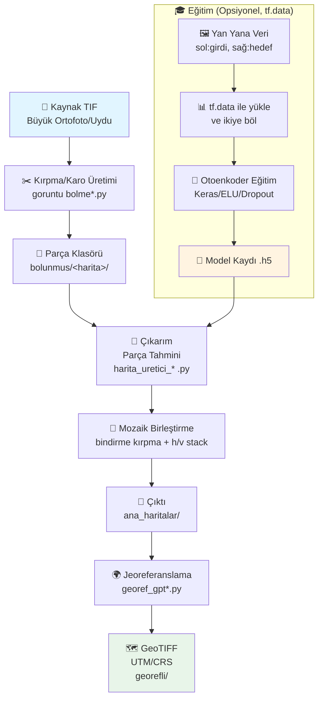

# 🗺️ AutoEncoder Map Generation Pipeline

> **tf.data + Keras ile Büyük Ölçekli Harita Üretim İş Hattı**

Bu proje, büyük ortofoto ve uydu görüntülerini karolara bölerek, eğitilmiş otoenkoder tabanlı derin öğrenme modelleriyle harita/stil tahmini yapan ve sonrasında karoları mozaikleyip GeoTIFF olarak jeoreferanslayan uçtan uca bir iş hattı sunar.

**Not:** Önceki Pix2Pix/GAN denemeleri arşivlenmiştir. Güncel ve sadeleştirilmiş akış, tf.data ile beslenen otoenkoder(ler) etrafında şekillenmiştir.

---

## 📋 İçindekiler

- [Özellikler](#-özellikler)
- [Mimari](#-mimari)
- [Dizin Yapısı](#-dizin-yapısı)
- [Akış Şeması](#-akış-şeması-e2e)
- [Kurulum](#-kurulum-ve-bağımlılıklar)
- [Kullanım](#-kullanım)
  - [Veri Hazırlama](#1-veri-hazırlama-karo-üretimi)
  - [Eğitim](#2-eğitim)
  - [Çıkarım](#3-çıkarım-toplu-karo-tahmini-ve-birleştirme)
  - [Jeoreferans](#4-jeoreferans-geotiff)
- [Yapılandırma](#-yapılandırma-ve-parametreler)
- [Performans](#-performans-ipuçları)
- [Sorun Giderme](#-sorun-giderme-faq)
- [Hızlı Başlangıç](#-hızlı-başlangıç)

---

## ✨ Özellikler

- **🎯 tf.data ile Akışkan Veri İşleme**: Yan yana (sol: giriş, sağ: hedef) tutulan eğitim görsellerini runtime'da ikiye bölerek RAM kullanımını optimize eder
- **🧠 Hafif U-Net Benzeri Otoenkoderler**: Encoder'de Conv+Pool, decoder'de UpSampling/TransposeConv; ELU + Dropout ile stabil ve hızlı eğitim
- **🔲 Büyük Görüntüler için Karo Tabanlı Üretim**: 512–544 piksel kare boyutları, bindirme payı ile dikiş izlerini azaltma
- **🔄 Çoklu Model Desteği**: `modeller/` klasöründeki tüm `.h5` dosyalarıyla aynı parça seti üzerinde çıkarım ve karşılaştırma
- **🌍 Jeoreferans/GeoTIFF Desteği**: Referans raster'ın CRS ve transform'u kopyalanarak çıktı mozaikler koordinatlandırılır
- **⭐ YENİ: Tek Dosyada Tüm İşlemler**: `goruntu_islemleri.py` ile bölme, model inference, birleştirme ve jeoreferanslama tek komutla
- **⭐ YENİ: Akıllı Referans Seçimi**: Görüntü dosya adına göre otomatik referans raster bulma
- **⭐ YENİ: Progress Bar Desteği**: Tüm işlemlerde ilerleme çubuğu ile durum takibi
- **⭐ YENİ: Akıllı Bölme Atlama**: Daha önce bölünmüş görüntüler için bölme işlemini atlama

---

## 🏗️ Mimari

Proje, aşağıdaki ana bileşenlerden oluşur:

1. **Veri Hazırlama**: Büyük TIF görüntülerini karolara bölme
2. **Eğitim Pipeline**: tf.data ile veri yükleme ve otoenkoder eğitimi
3. **Çıkarım Pipeline**: Toplu karo tahmini ve mozaik birleştirme
4. **Jeoreferans**: GeoTIFF formatında koordinatlandırma

---

## 📁 Dizin Yapısı

```
AutoEncoder_pix2pix/
│
├── 📄 goruntu bolme.py                    # Karo üretimi (544×544 + bindirme)
├── 📄 goruntu bolme_beta.py               # Karo üretimi (512×512 + bindirme, grid)
├── 📄 goruntu_islemleri.py                # ⭐ TÜM İŞLEMLERİ TEK DOSYADA (YENİ!)
│   └── Bölme + Model Inference + Birleştirme + Jeoreferanslama
│
├── 🧠 Eğitim Scriptleri
│   ├── autoencoder_dinamik_bellek_dosyadan_okuma_tf.data_renkli.py
│   │   └── Renkli (3 kanal → 3 kanal) eğitim
│   └── autoencoder_dinamik_bellek_dosyadan_okuma_tf.data_3_kanal_to_1_kanal.py
│       └── Gri/tek kanal (3→1 veya 1→1) eğitim
│
├── 🎨 Çıkarım Scriptleri
│   ├── harita_uretici_beta_gpt_hizli.py                    # Gri/tek-kanal çıkarım
│   ├── harita_uretici_beta_gpt_hizli_renkli.py            # Renkli çıkarım
│   └── harita_uretici_beta_gpt_hizli_3_kanal_to_1_kanal.py # RGB → 1 kanal çıkarım
│
├── 🌍 Jeoreferans Scriptleri
│   ├── georef_gpt.py
│   └── georef_gpt-ertugrul.py
│
├── 📂 bolunmus/                           # Üretilen karolar
│   └── bolunmus/                          # (goruntu_islemleri.py için)
│       └── <görüntü_adı>/                 # Her görüntü için alt klasör
│           ├── goruntu_0_0.jpg
│           ├── goruntu_0_1.jpg
│           └── metadata.json
│
├── 📂 modeller/                           # Eğitilmiş Keras modelleri (.h5)
│
├── 📂 parcalar/                            # Model'den geçmiş parçalar (goruntu_islemleri.py için)
│   └── <görüntü_adı>/
│       └── <model_adı>/
│
├── 📂 ana_haritalar/                       # Birleştirilmiş mozaik çıktıları (.jpg)
│
├── 📂 georeferans_sample/                  # ⭐ Referans raster dosyaları (YENİ!)
│   ├── ana_harita_urgup_30_cm__Georefference_utm.tif
│   └── ana_harita_karlik_30_cm_bingmap_Georeferans.tif
│
├── 📂 georefli/                           # Jeoreferanslı GeoTIFF çıktıları
│   ├── harita/                            # (georef_gpt-ertugrul.py için)
│   └── harita_temp/                       # (georef_gpt-ertugrul.py için, ara çıktı)
│
├── 📂 c:/d_surucusu/parcalar/              # Geçici parça çıktıları (eski scriptler için)
│
└── 📂 deleted/                            # Arşivlenmiş eski scriptler
```

---

## 🔄 Akış Şeması (E2E)



---

## 🚀 Kurulum ve Bağımlılıklar

### Gereksinimler

- **Python**: 3.8–3.10 (önerilir)
- **İşletim Sistemi**: Windows (PowerShell), Linux, macOS

### Gerekli Paketler

| Kategori | Paketler |
|----------|----------|
| **Derin Öğrenme** | `tensorflow` (veya `tensorflow-gpu`), `keras` |
| **Görüntü İşleme** | `opencv-python`, `Pillow`, `numpy`, `matplotlib`, `natsort` |
| **Coğrafi Veri** | `rasterio`, `GDAL` |
| **Opsiyonel** | `tensorflow-addons` (histogram eşitleme için) |

### Kurulum Yöntemleri

#### Yöntem 1: Virtual Environment (Python venv)

```powershell
# Sanal ortam oluştur
python -m venv .venv

# Sanal ortamı aktifleştir
.\.venv\Scripts\Activate.ps1

# pip'i güncelle
pip install --upgrade pip

# Paketleri yükle
pip install tensorflow opencv-python Pillow numpy matplotlib natsort rasterio tensorflow-addons

# Not: GDAL için Windows'ta hazır wheel kullanın (örn. Gohlke veya conda)
# pip ile kurulumda GDAL_VERSION ve include/library yollarını ayarlamanız gerekebilir
```

#### Yöntem 2: Conda (Önerilen) ⭐

```powershell
# Conda ortamı oluştur
conda create -n mapa python=3.10 -y

# Ortamı aktifleştir
conda activate mapa

# Paketleri yükle (conda-forge kanalından)
conda install -c conda-forge tensorflow rasterio gdal opencv pillow matplotlib natsort tensorflow-addons -y
```

> **💡 İpucu:** GDAL/Rasterio Windows kurulumunda sık hata alınır; mümkünse conda-forge tercih edin.

---

## 📖 Kullanım

### ⭐ 0. Tek Dosyada Tüm İşlemler (Önerilen - YENİ!)

**`goruntu_islemleri.py`** script'i tüm işlemleri tek seferde yapar: Bölme → Model Inference → Birleştirme → Jeoreferanslama

#### Özellikler

- ✅ Parametre olmadan varsayılan değerlerle çalışma
- ✅ Görüntü adına göre otomatik klasör oluşturma
- ✅ Daha önce bölünmüş görüntüler için akıllı atlama
- ✅ Görüntü adına göre otomatik referans raster seçimi
- ✅ Progress bar ile ilerleme takibi
- ✅ Çoklu model desteği (tüm modeller otomatik işlenir)

#### Hazırlık

1. **Referans raster dosyalarını `georeferans_sample/` klasörüne koyun:**
   ```powershell
   # Klasör otomatik oluşturulur, veya manuel oluşturabilirsiniz
   mkdir georeferans_sample
   
   # Referans dosyalarını kopyalayın
   # Örnek:
   # - ana_harita_urgup_30_cm__Georefference_utm.tif
   # - ana_harita_karlik_30_cm_bingmap_Georeferans.tif
   ```

2. **Modelleri `modeller/` klasörüne koyun** (opsiyonel - model yoksa sadece bölme ve birleştirme yapar)

3. **Script içinde varsayılan görüntü dosyasını ayarlayın** (veya parametre ile belirtin)

#### Kullanım

```powershell
# Parametre olmadan çalıştırma (varsayılan değerlerle)
python goruntu_islemleri.py

# Veya parametre ile:
python goruntu_islemleri.py split -i image.tif
python goruntu_islemleri.py merge -i parcalar -o merged.jpg
python goruntu_islemleri.py georef -i image.jpg -r reference.tif -o geo.tif
```

#### Varsayılan Değerler

Script içinde (`if __name__ == "__main__":` bölümünde) varsayılan değerler ayarlanabilir:

```python
DEFAULT_INPUT_IMAGE = "karlik_30_cm_bingmap_utm.tif"
DEFAULT_MODEL_DIR = "modeller"
DEFAULT_REFERENCE_DIR = "georeferans_sample"
```

#### İşlem Akışı

1. **Bölme**: Görüntüyü `bolunmus/bolunmus/<görüntü_adı>/` klasörüne böler
   - Klasör varsa ve içinde dosyalar varsa bölme atlanır
   - Metadata kaydedilir (`metadata.json`)

2. **Model Inference**: `modeller/` klasöründeki tüm modelleri kullanarak inference yapar
   - Her model için ayrı çıktı klasörü: `parcalar/<görüntü_adı>/<model_adı>/`
   - Threading ile hızlı işleme

3. **Birleştirme**: Her model için ayrı birleştirme yapar
   - Çıktı: `ana_haritalar/ana_harita_<görüntü_adı>_<model_adı>.jpg`

4. **Jeoreferanslama**: Görüntü adına göre otomatik referans bulur ve jeoreferanslar
   - Referans: `georeferans_sample/` klasöründen otomatik seçilir
   - Çıktı: `georefli/harita/<dosya_adı>_geo.tif`

#### Referans Raster Eşleştirme

Script görüntü dosya adından anahtar kelimeleri çıkarır ve en uygun referansı bulur:

- **Eşleştirme Puanlama:**
  - Anahtar kelime eşleşmesi (urgup, karlik): +20 puan
  - "ana_harita" ile başlayan dosyalar: +10 puan
  - "georef", "reference" kelimeleri: +5 puan
  - "utm" kelimesi: +3 puan

**Örnek:**
- Görüntü: `urgup_bingmap_30cm_utm.tif`
- Referans: `ana_harita_urgup_30_cm__Georefference_utm.tif`
- Puan: 20 (urgup) + 10 (ana_harita) + 5 (georef) + 3 (utm) = **38 puan** ✅

#### Çıktı Örneği

```
============================================================
PARAMETRE VERİLMEDİ, VARSAYILAN DEĞERLERLE TAM PİPELİNE ÇALIŞTIRILIYOR
============================================================
============================================================
1. ADIM: Görüntü Bölme
============================================================
Parçalar bölünüyor: 100%|████████████| 2640/2640 [00:45<00:00, 58.2parça/s]
✓ Bölme tamamlandı: 2640 parça

============================================================
2. ADIM: Model Inference
============================================================
Model inference: 100%|████████████| 2640/2640 [05:23<00:00, 8.2görüntü/s]
✓ Model model1 tamamlandı

============================================================
3. ADIM: Görüntü Birleştirme
============================================================
✓ Birleştirme tamamlandı: ana_haritalar/ana_harita_karlik_30_cm_bingmap_utm_model1.jpg

============================================================
4. ADIM: Jeoreferanslama
============================================================
Referans dizininde 2 dosya bulundu: georeferans_sample
✓ Referans raster bulundu: ana_harita_karlik_30_cm_bingmap_Georeferans.tif (eşleşme puanı: 38)
  Görüntü: karlik_30_cm_bingmap_utm.tif
  Referans: ana_harita_karlik_30_cm_bingmap_Georeferans.tif
Jeoreferanslama: 100%|████████████| 1/1 [00:12<00:00, 12.3s/dosya]
✓ Jeoreferanslama tamamlandı
```

---

### 1. Veri Hazırlama (Karo Üretimi)

Büyük `.tif` ortofoto/uydu görselini karolara bölün.

#### Script Seçimi

| Script | Özellikler | Kullanım |
|--------|------------|----------|
| `goruntu bolme.py` | Basit ve kare ölçekli | 544×544 + bindirme |
| `goruntu bolme_beta.py` | Tam grid üzerinde | 512×512 + bindirme, X×Y grid |

#### Kullanım

1. Script içinde `path` değişkenini kaynak TIF dosyanıza ayarlayın
2. Script'i çalıştırın:

```powershell
python "goruntu bolme.py"
```

**Çıktılar:**
- `goruntu bolme.py`: `bolunmus/<harita>_goruntu<numara>_g.jpg`
- `goruntu bolme_beta.py`: `bolunmus/bolunmus/<harita>_goruntu<numara>_g.jpg` (⚠️ **Not:** Çift klasör yapısı kullanılıyor)

**Parametreler:**
- `goruntu bolme.py`: `frame_size=544`, `genisletme=32`
- `goruntu bolme_beta.py`: `frame_size=512`, `genisletme=32`

> **Not:** Bindirme (genişleme) pikselleri birleştirme aşamasında içerden kırpılır, böylece dikiş izleri azaltılır. Çıkarım scriptlerinde bindirme kırpma değeri **16 piksel** olarak ayarlanmıştır.

---

### 2. Eğitim

#### Veri Formatı

Eğitim verisi tek görüntü içinde **"yan yana ikili"** formatta olmalıdır:

- **Sol yarı**: Giriş (ör. uydu/ortofoto)
- **Sağ yarı**: Hedef (istenen stil/harita)

Scriptler bu görüntüyü runtime'da ikiye böler, 544×544'e yeniden boyutlandırır ve `[-1, 1]` aralığına normalleştirir.

#### 2.1. Renkli Eğitim (3→3)

**Dosya:** `autoencoder_dinamik_bellek_dosyadan_okuma_tf.data_renkli.py`

**Yapılandırma:**

1. Veri kökünü değiştirin:
   ```python
   all_image_paths = "C:\\d_surucusu\\satnap\\output_ps_renkli\\" + ...
   ```

2. Model: `create_gpt_autoencoder_none_regularization(...)` 
   - ELU + Dropout aktivasyonları
   - 3 kanal çıktı

3. **Önemli:** Script, modeli oluşturduktan sonra `son_model.h5` yükleyerek devam eğitim kurgusuna uygun çalışır. 
   - Sıfırdan eğitim için: `model = load_model("son_model.h5")` satırını yoruma alın
   - Devam eğitim için: Bu satırı aktif tutun

**Varsayılan Parametreler:**
- **Batch size:** 16
- **Epochs:** 21
- **Train/Val Split:** %80/%20 (kod içinde `split_at = int(len(all_image_paths) * 0.8)`)
- **Optimizer:** Adam (learning rate: 0.0005)
- **Loss:** MSE

**Çalıştırma:**

```powershell
python "autoencoder_dinamik_bellek_dosyadan_okuma_tf.data_renkli.py"
```

**Çıktılar:**
- `son_model.h5`: Son eğitilmiş model
- Epoch bazlı checkpoint'ler: `_<tarih>_model_f<filtre>_k<kernel>_epoch_<epoch>_<activation>_<strides>_.h5`

#### 2.2. Gri/Tek Kanal Eğitim (3→1 veya 1→1)

**Dosya:** `autoencoder_dinamik_bellek_dosyadan_okuma_tf.data_3_kanal_to_1_kanal.py`

**Yapılandırma:**

1. Veri kökünü değiştirin:
   ```python
   all_image_paths = "C:\\d_surucusu\\satmap\\output_full\\" + ...
   ```

2. **Histogram eşitleme:** `tensorflow-addons` ile `tfa.image.equalize` aktif olarak kullanılıyor (giriş görüntülerinde)

3. Varsayılan model: `create_advanced_autoencoder(...)` (1 kanal çıktı)

4. Devam eğitimi için: `model = load_model("son_model.h5")` satırını kontrol edin

**Varsayılan Parametreler:**
- **Batch size:** 8
- **Epochs:** 20
- **Train/Val Split:** %90/%10 (kod içinde `split_at = int(len(all_image_paths) * 0.9)`)
- **Optimizer:** Adam (learning rate: 0.001)
- **Loss:** MSE

**Çalıştırma:**

```powershell
python "autoencoder_dinamik_bellek_dosyadan_okuma_tf.data_3_kanal_to_1_kanal.py"
```

**Çıktılar:**
- `son_model.h5`: Son eğitilmiş model
- Epoch bazlı checkpoint'ler: `_<tarih>_model_f<filtre>_k<kernel>_epoch_<epoch>_<activation>_<strides>_.h5`

---

### 3. Çıkarım (Toplu Karo Tahmini ve Birleştirme)

#### Hazırlık

1. Eğitilmiş modelleri `modeller/` klasörüne koyun (birden fazla `.h5` dosyası desteklenir)
2. Karo klasörünüz `bolunmus/<harita>/...` şeklinde olmalı

#### Çıkarım Scriptleri

| Senaryo | Script | Açıklama |
|---------|--------|----------|
| **Gri/Tek kanal** | `harita_uretici_beta_gpt_hizli.py` | Tek kanal çıkarım + mozaik birleştirme |
| **Renkli** | `harita_uretici_beta_gpt_hizli_renkli.py` | Renkli çıkarım + mozaik birleştirme |
| **RGB → 1 kanal** | `harita_uretici_beta_gpt_hizli_3_kanal_to_1_kanal.py` | RGB giriş → 1 kanal çıktı |

#### Kullanım

```powershell
# Gri/tek kanal çıkarım
python "harita_uretici_beta_gpt_hizli.py"

# Renkli çıkarım
python "harita_uretici_beta_gpt_hizli_renkli.py"

# 3→1 varyantı
python "harita_uretici_beta_gpt_hizli_3_kanal_to_1_kanal.py"
```

**İşlem Adımları:**

1. Script, parçaları model(ler) ile tahmin eder
2. Bindirme kenarlarını içerden kırpar (**16 piksel** her kenardan)
3. Satır-sütun halinde birleştirir
4. Ara çıktı: `c:/d_surucusu/parcalar/<harita>_<model>/goruntu_<dosya>.jpg`
5. Final çıktı: `ana_haritalar/ana_harita_<harita>_<model>.jpg`

**Önemli Notlar:**

- **Grid ölçüleri:** Script'lerde sabit başlangıç değeri (`frame_adedi_x`, `frame_adedi_y`) ve karekök tabanlı otomatik kare grid modu bulunur. Parça sayınız kare sayı değilse script içindeki `frame_adedi_x/y` değerlerini manuel ayarlayın (ör. ürgüp için: `frame_adedi_x = 44`, `frame_adedi_y = 60`).
- **Renk dönüşümü:** Renkli akışta OpenCV BGR sırası ile RGB karışabilir; gerekli dönüşümler script'te yapılmıştır (`cv2.COLOR_BGR2RGB`).
- **Ara çıktı klasörü:** Geçici parça çıktıları `c:/d_surucusu/parcalar/` klasörüne kaydedilir. Bu klasörün var olduğundan emin olun veya script'i düzenleyerek farklı bir yol kullanın.

---

### 4. Jeoreferans (GeoTIFF)

Mozaiklenmiş çıktı `.jpg` dosyalarını bir referans GeoTIFF'in CRS ve transform'u ile jeoreferanslayın.

#### Yöntem 1: goruntu_islemleri.py ile (Önerilen ⭐)

**Otomatik referans seçimi** ile çalışır. Referans dosyalarını `georeferans_sample/` klasörüne koyun.

```powershell
# Tam pipeline ile (otomatik jeoreferanslama dahil)
python goruntu_islemleri.py

# Sadece jeoreferanslama
python goruntu_islemleri.py georef -i image.jpg
# Referans otomatik bulunur, veya manuel belirtilebilir:
python goruntu_islemleri.py georef -i image.jpg -r reference.tif -o geo.tif
```

#### Yöntem 2: Eski Script'ler ile

**Yapılandırma:**

1. **Referans raster yolunu script içinde ayarlayın:**
   ```python
   # georef_gpt.py ve georef_gpt-ertugrul.py içinde:
   georasterref = rasterio.open("ana_harita_urgup_30_cm__Georefference_utm.tif")
   # Diğer seçenekler yorum satırı olarak mevcuttur:
   # - ana_harita_karlik_30_cm_bingmap_Georeferans.tif
   # - urgup_gmap_30_cm_georeferans.tif
   # - karlik_30_cm_bingmap_utm_georefference.tif
   ```

**Çalıştırma:**

```powershell
python "georef_gpt.py"
# veya
python "georef_gpt-ertugrul.py"
```

**Çıktılar:**

- **georef_gpt.py:**
  - Ara çıktı: `georefli/harita/<harita>_geo.tif` (LZW sıkıştırma)
  - Final çıktı: `georefli/<harita>_UTM_geo_r.tif` (JPEG sıkıştırma)

- **georef_gpt-ertugrul.py:**
  - Ara çıktı: `georefli/harita_temp/<harita>_geo.tif` (LZW sıkıştırma)
  - Final çıktı: `georefli/harita/<harita>_UTM_geo_r.tif` (JPEG sıkıştırma)

**Not:** Script'ler `ana_haritalar/` klasöründeki tüm `.jpg` dosyalarını otomatik olarak işler.

---

## ⚙️ Yapılandırma ve Parametreler

### Önemli Parametreler

| Parametre | Konum | Açıklama |
|-----------|-------|----------|
| **Karo boyutu** | `goruntu bolme*.py` | `frame_size` (512 veya 544) |
| **Bindirme payı** | `goruntu bolme*.py` | `genisletme` (piksel cinsinden) |
| **Eğitim verisi kökü** | Eğitim script'leri | `all_image_paths` değişkeni |
| **Giriş/çıkış kanalları** | Model fonksiyonları | 3→3, 3→1, 1→1 |
| **Batch size** | Eğitim script'leri | Renkli: 16, Gri: 8 (GPU VRAM'a göre ayarlayın) |
| **Epochs** | Eğitim script'leri | Renkli: 21, Gri: 20 |
| **Train/Val Split** | Eğitim script'leri | Renkli: %80/%20, Gri: %90/%10 |
| **Optimizer & Loss** | Eğitim script'leri | Adam optimizer (Renkli: lr=0.0005, Gri: lr=0.001), MSE loss |
| **Model yükleme** | Eğitim script'leri | `model = load_model("son_model.h5")` (devam eğitim için) |
| **Bindirme kırpma** | Çıkarım script'leri | `genisleme = 16` piksel (her kenardan) |
| **Grid boyutları** | Çıkarım script'leri | `frame_adedi_x`, `frame_adedi_y` (manuel veya otomatik karekök) |
| **Çıkarım model klasörü** | Çıkarım script'leri | `modeller/` |
| **Ara çıktı klasörü** | Çıkarım script'leri | `c:/d_surucusu/parcalar/` (geçici parça çıktıları) |
| **Final çıktı klasörleri** | Script'ler | `ana_haritalar/`, `georefli/` |
| **Referans raster klasörü** | `goruntu_islemleri.py` | `georeferans_sample/` (otomatik referans seçimi) |
| **Referans raster** | Eski jeoreferans script'leri | Script içinde hardcoded, değiştirilmesi gerekir |
| **Progress bar** | `goruntu_islemleri.py` | tqdm ile otomatik (yoksa basit fallback) |
| **Akıllı bölme atlama** | `goruntu_islemleri.py` | Klasör varsa bölme atlanır |

### Öneri

Yolları ve parametreleri merkezi bir `config.yaml` dosyasına almak taşınabilirliği artırır (isteğe bağlı).

---

## 🚀 Performans İpuçları

### tf.data Optimizasyonu

- `num_parallel_calls`, `batch`, `prefetch` değerlerini donanıma göre yükseltin
- `AUTOTUNE` çoğu ortamda iyi çalışır

### GPU Kullanımı

- TensorFlow GPU kurulumunu doğrulayın: `tf.config.list_physical_devices('GPU')`
- Batch size'ı VRAM'a göre ayarlayın
- Mixed precision training kullanmayı düşünün

### I/O Optimizasyonu

- Karo boyutu ve bindirme, disk I/O ve RAM kullanımını belirler
- Daha az bindirme daha hızlı, fakat dikiş riskini artırır
- SSD kullanımı önerilir

### Çıkarım Optimizasyonu

- `harita_uretici_beta_gpt_hizli*.py` paralel çıkarım yapar
- CPU çekirdeklerine göre thread sayısını sınırlandırmak isteyebilirsiniz
- Batch inference kullanarak GPU kullanımını artırın

---

## 🔧 Sorun Giderme (FAQ)

### GDAL/Rasterio Kurulumu Hata Veriyor

**Sorun:** Windows'ta GDAL kurulumu başarısız oluyor.

**Çözüm:**
- Conda-forge ile kurulum yapın (önerilen)
- pip ile kurulumda GDAL_VERSION ve include/library yollarını ayarlamanız gerekebilir
- Alternatif: [OSGeo4W](https://trac.osgeo.org/osgeo4w/) kullanın

### Renkler Ters Görünüyor (Çıkarım)

**Sorun:** Üretilen görüntülerde renkler beklenenden farklı.

**Çözüm:**
- OpenCV BGR, matplotlib RGB kullanır
- Script'te `cvtColor` dönüşümü var; görsel yolunuza göre düzenleyin
- Gerekirse `cv2.COLOR_BGR2RGB` veya `cv2.COLOR_RGB2BGR` kullanın

### Eğitim Yeniden Başlamak Yerine "Devam Ediyor"

**Sorun:** Script her çalıştırmada önceki modeli yüklüyor.

**Çözüm:**
- Script'teki `model = load_model("son_model.h5")` satırını yoruma alın
- Veya `son_model.h5` dosyasını geçici olarak taşıyın

### Karo Sayısından Grid Hesaplanamıyor

**Sorun:** Grid boyutları yanlış hesaplanıyor.

**Çözüm:**
- Script'teki `frame_adedi_x/y` değerlerini manuel ve doğru şekilde ayarlayın
- Parça sayısını kontrol edin: `len(os.listdir("bolunmus/<harita>/"))`

### Bellek Hataları

**Sorun:** Out of memory (OOM) hataları alıyorum.

**Çözüm:**
- `batch_size` değerini düşürün
- Karoları diskten akışkan okuyun (zaten tf.data yapıyor)
- Görsel çözünürlüğünü azaltmayı düşünün
- GPU'da mixed precision training kullanın

### Model Yüklenemiyor

**Sorun:** `.h5` dosyası yüklenirken hata alıyorum.

**Çözüm:**
- Model dosyasının tam yolunu kontrol edin
- TensorFlow/Keras sürüm uyumluluğunu kontrol edin
- Model dosyasının bozuk olmadığından emin olun

---

## 🎯 Hızlı Başlangıç

### ⭐ Yöntem 1: Tek Komutla Tüm İşlemler (Önerilen)

```powershell
# 1. Referans raster dosyalarını georeferans_sample/ klasörüne koyun
mkdir georeferans_sample
# Referans dosyalarını kopyalayın (örn: ana_harita_urgup_30_cm__Georefference_utm.tif)

# 2. Modelleri modeller/ klasörüne koyun (opsiyonel)

# 3. Script içinde varsayılan görüntü dosyasını ayarlayın
#    veya parametre ile belirtin

# 4. Çalıştırın
python goruntu_islemleri.py
```

**Çıktılar:**
- Bölünmüş parçalar: `bolunmus/bolunmus/<görüntü_adı>/`
- Model çıktıları: `parcalar/<görüntü_adı>/<model_adı>/`
- Birleştirilmiş görüntüler: `ana_haritalar/`
- Jeoreferanslı görüntüler: `georefli/harita/`

---

### Yöntem 2: Adım Adım (Eski Yöntem)

#### Adım 1: Karo Üretimi

```powershell
# goruntu bolme.py içinde path değişkenini kaynak TIF'e ayarlayın
python "goruntu bolme.py"
```

**Çıktı:** 
- `goruntu bolme.py`: `bolunmus/<harita>_goruntu<numara>_g.jpg`
- `goruntu bolme_beta.py`: `bolunmus/bolunmus/<harita>_goruntu<numara>_g.jpg` (⚠️ çift klasör)

---

#### Adım 2: Eğitim (Opsiyonel)

```powershell
# Veri kökünü eğitim script'inde all_image_paths değişkenine ayarlayın
python "autoencoder_dinamik_bellek_dosyadan_okuma_tf.data_renkli.py"
```

**Çıktı:** `son_model.h5` ve checkpoint'ler

---

#### Adım 3: Çıkarım + Birleştirme

```powershell
# Modelleri modeller/ klasörüne koyun
python "harita_uretici_beta_gpt_hizli.py"
```

**Çıktılar:**
- Ara çıktı: `c:/d_surucusu/parcalar/<harita>_<model>/goruntu_<dosya>.jpg`
- Final çıktı: `ana_haritalar/ana_harita_<harita>_<model>.jpg`

---

#### Adım 4: Jeoreferans/GeoTIFF

```powershell
# Referans raster yolunu script içinde ayarlayın
python "georef_gpt.py"
```

**Çıktılar:**
- `georef_gpt.py`: `georefli/<harita>_UTM_geo_r.tif`
- `georef_gpt-ertugrul.py`: `georefli/harita/<harita>_UTM_geo_r.tif`

---

## 📝 Lisans

Bu proje akademik/araştırma amaçlı geliştirilmiştir.

---

## 🤝 Katkıda Bulunma

Öneriler ve katkılarınızı bekliyoruz! Lütfen issue açarak veya pull request göndererek katkıda bulunun.

---

**Keyifli çalışmalar! 🚀**
